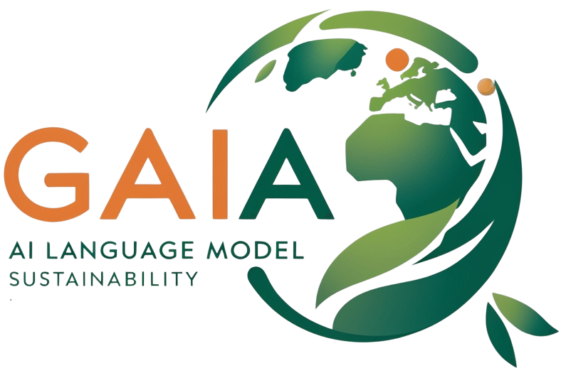

# GAIA

GAIA, derived from Gestão Ambiental com Inteligência Artificial, is a cutting-edge Generative AI tool specializing in the climate and environmental landscape of Brazil. ts mission is to empower citizens with accessible knowledge of the latest laws and regulations regarding Brazil's climate and environment, regardless of their level of expertise. Leveraging over 1,500 pages of official documents, GAIA is designed to assist users in several key areas:

- **Understanding Climate and Environmental Topics:** GAIA provides insights into various climate-related subjects, curiosities, and facts to enhance users’ awareness and knowledge.
-  **Guidance for Public Managers:** Local government officials can utilize GAIA to learn how to adapt their towns and cities to comply with current regulations and strategic plans, ensuring sustainable development within their communities.
- **In-Depth Research Support:** Environmental specialists and researchers can receive detailed explanations and analyses of environmental plans, helping them navigate complex information and enhance their studies.

Whether you are a curious citizen, a public manager striving for compliance, or a researcher seeking comprehensive insights, GAIA is here to support your journey toward a better understanding of Brazil's environmental landscape. GAIA was developed by Group 1 at BCG X Challenge 2024:

- Marcelo S. Freires
- Matheus Baptistella
- Melissa Freitas
- Vitor Belini Contato Rodrigues

## How it works?
GAIA is much more than just a Generative AI; it is a comprehensive system designed to meet users' needs effectively. Here’s a brief overview of its functionality:

1. **Content Preparation:** The process begins with the cleaning and refinement of documents, extracting only useful and essential information. This ensures that users receive relevant insights without unnecessary clutter.
2. **Embedding Process:** The refined texts and images undergo a transformation known as Embedding. During this process, human-readable information—such as words, paragraphs, titles, and images—is converted into vectors. These vectors classify the information based on various criteria, allowing GAIA to efficiently identify the most relevant answers to your queries.
3. **Vector Storage:** The resulting vectors are stored in a specialized Vector Database, which is optimized for this type of information storage and retrieval.
4. **User Interaction:** When a user sends a message, it is also embedded into a vector format. This vector is then compared to the document vectors to determine similarity—words with similar meanings will appear "closer" in this vector space.
5. **Answer Retrieval:** GAIA utilizes a Large Language Model (LLM), specifically OpenAI's GPT-4 model, to find answers within the official documents. This ensures that the responses are grounded in verified sources, minimizing the risk of inaccurate information or "hallucinations."

Through this intricate process, GAIA provides users with accurate, relevant, and reliable answers to their questions about Brazil’s climate and environmental regulations.

## Usage
To get started with GAIA, clone this repository and navigate to the project directory:
```
cd BCGx-Challenge2024
```

Then, create a `.env` file at the root of the repository: this file is going to be used to save the credentials. The file `.env.example` is an example of how what .env should contain.
```
touch .env
```

All necessary services for GAIA's operation can be initialized using Docker. Run the following command to build and start the services:
```
docker compose up --build
```

Please wait for the images to be fetched and the containers to be built. This process should take approximately 3–4 minutes due to the frontend service relying on Flutter and its SDK. Once the process is complete, you can access GAIA by navigating to `http://localhost:3000` in your web browser. We recommend using Google Chrome, as the project has been primarily tested in this environment.

## Documentation
This section provides a detailed technical explanation of the services, technologies, and architecture that comprise GAIA's system design.

### Software Engineering Aspects
GAIA utilizes a microservices architecture, which is crucial for ensuring scalability, flexibility, and maintainability. This approach allows the system to decompose complex functionalities into smaller, independent services that can be developed, deployed, and scaled individually. Following this paradigm, GAIA is composed of three primary services:

- **Frontend:** The frontend is developed in Flutter and serves as the user interface (UI) layer. It abstracts some of the logic involved in the interaction between users and the language model (LLM). You can explore the frontend code in the `frontend/` folder.
- **Backend:** The backend is implemented in Python and handles the core business logic of the project. This includes tasks such as user account creation, prompt generation, and fetching responses from the LLM. The backend code can be found in the `backend/` folder.
- **Database:** The database utilizes relational features (SQL) to store data that supports the application’s functionality. It employs the PostgreSQL database management system to establish relationships between stored data, ensuring an optimal user experience.

All these services are instantiated using Docker containers. The file `docker-compose.yml` contains the instructions that Docker must follow to initialize this application. In the following sections, we will delve deeper into each of these services, providing a comprehensive understanding of their roles and interactions within the GAIA system.

#### Frontend
The frontend service leverages Flutter's widgets to create a seamless interaction between the user and the LLM. The UI is designed to be simple, useful, and organized, empowering users to have full control over the customization of their profiles and messages. The most relevant screens are:

- **Sign Up:** Users can enter their email, password, and choose between roles to create an account on GAIA.
- **Sign In:** Users can input their credentials to access the application.
- **Auth:** The frontend handles the submission of authentication tokens to verify the user's identity without the need to input their credentials for every interaction.
- **Home:** This is where users can interact with the LLM through a chat, view past chats, and start new conversations.

This service leverages two major packages to provide this experience: [BLoC](https://pub.dev/packages/flutter_bloc) and [Dio](https://pub.dev/packages/dio). The BLoC (Business Logic Component) package is responsible for managing the state of the UI and acts directly in the presentation layer. Instead of a single global state, each component/widget has its own state and behaves accordingly. Specifically, GAIA uses Cubits to handle state: they are similar to Blocs, with the difference that the former controls state through functions, while the latter does so through events. The Cubits are responsible for several actions in the UI, including:

- Displaying errors upon unsuccessful requests.
- Changing the screen according to the user authentication status.
- Starting animations during loading periods.
- Reflecting changes during a conversation in a chat with the AI.

The Cubits are defined at `frontend/lib/presentation/<screen_name>/cubits`. Moreover, developing the frontend in Flutter makes it easy to add features like a splash screen and to make the UI responsive (try resizing the screen).

On the other hand, Dio operates in the data layer, orchestrating the frontend's interaction with the backend. This is done via the HTTP protocol: actions on the UI result in HTTP requests, which are processed by the backend and culminate in a response sent back to the frontend. These responses can either be successful or not; Dio determines that responses with a 2XX HTTP Status Code are successful, while those with 4XX and 5XX are not. Dio also handles the building of the HTTP headers necessary for some operations. For example, when authenticating, the user must provide the JWT Access Token, which requires an HTTP `Authorization: Bearer YOUR_ACCESS_TOKEN`. Speaking of tokens, GAIA stores the access and refresh tokens locally in the browser using the [SharedPreferences](https://pub.dev/packages/shared_preferences) package; more on this later.

The Dio requests are defined at `frontend/lib/data/sources/<layer_name>`.

#### Backend
The backend service utilizes the FastAPI framework to provide an API that adheres to REST principles. This service was designed to contain single-purpose routes with defined objectives, which the UI can request to receive the desired response. It is composed of several major parts:

- **Routes:** These are the API endpoints to which the frontend makes requests. For example, a GET request with a query parameter of `chat_id` to the URL `http://localhost/chats/{chat_id}` will retrieve information about the chat that has `id == chat_id`.
- **Schemas:** These determine the data models from the Pydantic library used in processing requests and responses. This allows the backend to perform data validation on incoming data, rejecting unwanted formats instead of processing unvalidated data and risking undefined behavior.
- **Database Models:** The SQLAlchemy library provides models to define and manage the information stored in the tables in the PostgreSQL database. It also enables the definition of queries to retrieve the data stored in that database. For instance, GAIA defines that each user must have an `id` of type UUID. This `id` serves as their Primary Key, distinguishing one user from another. In the chats table, we store the user ID that owns that chat as a Foreign Key. This way, when trying to retrieve the content of a chat, the backend service can fetch only the chats that belong to the user.
- **CRUD:** The backend API follows CRUD principles, where the operations performed in the API have a single defined purpose.

In order for the backend to perform operations, the user must authenticate themselves. GAIA leverages the JWT (JSON Web Tokens) authentication mechanism to provide stateless authentication. Upon signing in, the user is provided with two JWT tokens: an access token, which lasts a couple of minutes, and a refresh token, which lasts for days. Using tokens allows the frontend to avoid having to provide the user's credentials (email and password) for every request. For example, if the authentication mechanism relied on sessions, allowing a user to update a chat would require the backend to fetch their session from a cache, which can be slow if multiple API instances are trying to read from and write to the cache. By using JWT, GAIA can determine the authenticity of a request mathematically by decoding the token. If the access token is expired, the frontend can provide the refresh token to obtain a new access token, avoiding the need to re-enter credentials.

### Data Science Aspects

This chatbot project uses a Retrieval-Augmented Generation (RAG) pipeline to answer questions related to the climate crisis. Below, we explain each stage of the pipeline and how the different components interact to generate quality responses.

#### User Input
The chatbot processes the user's input in real-time. The first step is question classification:

**General Question**: These are trivial questions or interactions that can be answered directly, without the need to search through documents (e.g., greetings, general information).
**Specific Question**: These are questions that require an answer based on information contained in external documents, such as reports or climate action plans.
The classification of the input is done automatically through a language model (LLM) that decides whether the question can be answered directly or if it needs to consult the document database.

#### Question Classification
The pipeline uses an LLM to classify the user's question based on its content. The process follows this logic:

General Questions: Direct and quick responses are provided.
Specific Questions: A query is triggered to the document database to retrieve relevant contextual information.
This classification is essential to optimize the chatbot's performance, allowing it to respond quickly to simple questions and provide more complex answers based on documents when necessary.

#### Document Retrieval (RAG)
When a question is classified as specific, the chatbot searches for documents that contain relevant information to generate an accurate answer. We use FAISS as a vector database to store embeddings generated from the documents.

- Embedding Storage: Documents are converted into embeddings using the OpenAI API and stored in the FAISS vector database.
- Retrieval Mechanism: FAISS is used to retrieve documents similar to the question based on embeddings. To optimize the search, we use a combination of parameters, such as:
- Score Threshold: Sets a minimum similarity threshold between the documents and the question.
- k: Limits the number of documents returned in the search to avoid overload.

#### Answer Generation
After retrieving relevant documents, the chatbot uses the context from these documents and the conversation history to generate an answer.

- **Language Model (LLM)**: The model used is GPT-4, accessed via the LangChain library. Specific LLM parameters are adjusted to optimize answer generation:
- **Temperature**: Controls the creativity of the responses (the higher, the more creative).
- **Frequency Penalty**: Penalizes word repetition, promoting more variety.
- **Presence Penalty**: Encourages the use of new topics and terms in the answer.
These parameters allow for a balance between creativity, accuracy, and fluency in the generated responses.

#### Conversational Memory
The chatbot uses an advanced memory system to improve the coherence of answers throughout an interaction. We use LangChain to manage multiple types of memory:

- **ConversationSummaryMemory**: Summarizes past interactions to ensure the chatbot remembers topics discussed earlier in the conversation.
- **ConversationEntityMemory**: Stores entities (names, places, dates) mentioned during the conversation to provide more contextualized answers.
These memory mechanisms ensure that the chatbot maintains a continuous context throughout long interactions, avoiding unnecessary repetition of information.

#### User Roles
The chatbot adapts its responses based on the user's role, which is defined at the start of the conversation. There are three available profiles:

- **Standard User**: *Simple and accessible answers, with less technical detail.*
- **Environmental Specialist**: *Detailed responses with technical terms and greater depth on climate-related topics.*
- **Municipal Manager**: *Focused on practical actions that can be implemented at the municipal level.*
The user's role is incorporated into the model's prompt, ensuring that the tone and level of detail of the answers are adjusted according to the user's profile.

#### Response Validation (RAGAS)
The quality of the responses generated by the chatbot is evaluated using the RAGAS framework, which measures several key metrics to ensure the accuracy and relevance of the answers. Some examples of used metrics:

- **Faithfulness**: *Measures how faithfully the generated response reflects the source documents.*
- **Answer Correctness**: *Evaluates the correctness of the answers based on the user's question.*

These metrics help ensure that the chatbot provides reliable answers based on relevant documentary sources.

## Next Steps
### Security Improvements
GAIA's security architecture has several areas that could benefit from enhancement. Currently, all communication between services relies on the HTTP protocol, where access tokens are sent in the headers without encryption. This exposes a critical vulnerability, as an attacker could potentially execute a man-in-the-middle attack and intercept the user's token. Additionally, the tokens are stored in the browser without encryption, further increasing the risk of compromise.

### Scalability Enhancements
On the scalability front, GAIA's current design may struggle under high demand. When multiple users send requests to the backend API, some operations may take longer to process, creating delays. To mitigate this, GAIA could implement an asynchronous message broker to manage communication queues between the user, the backend API, and external services like OpenAI. This approach would minimize idle time for the backend, streamline request handling, and significantly enhance the user experience.

# Video Demo
[](https://youtu.be/evtT280ONAI?si=mm97N_yLy3Mr692_)
